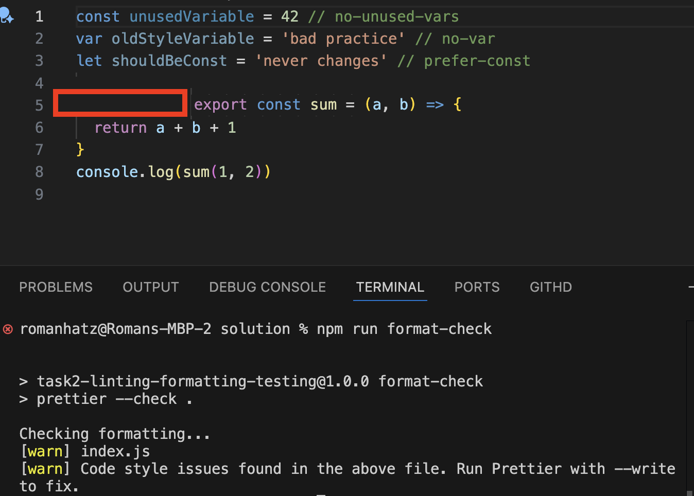
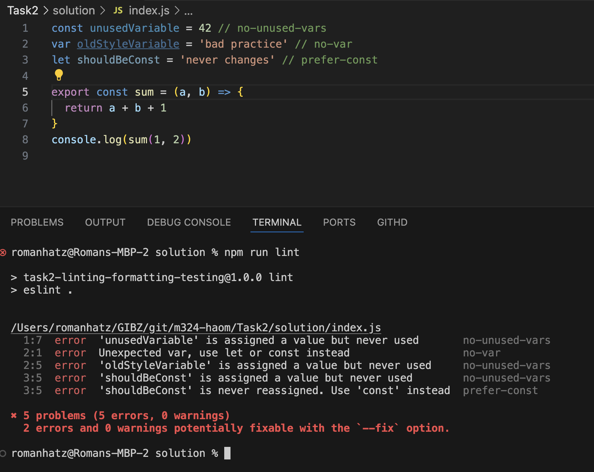
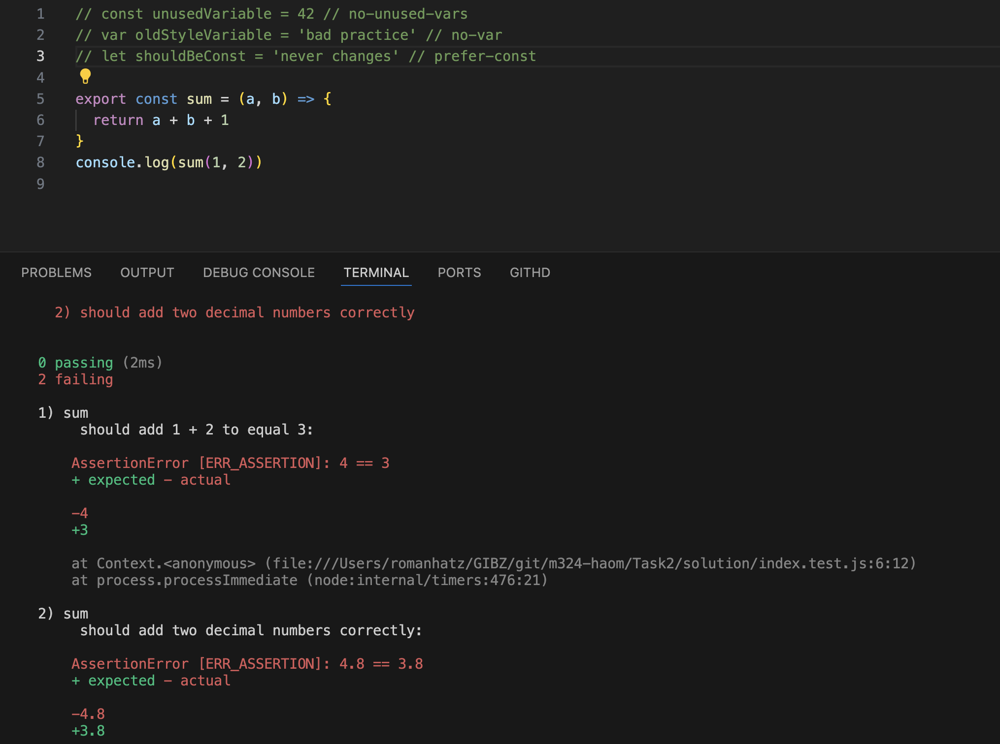
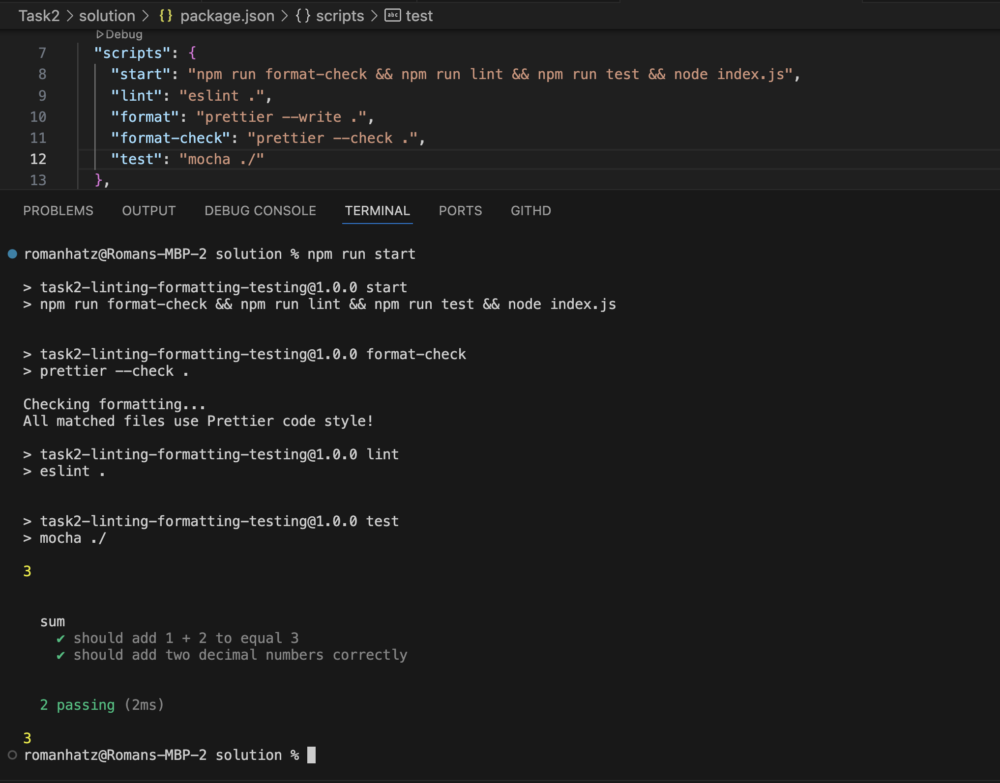

# Task 2: Linting, Formatting, Testing - Lösung

Hinweis: Die Bilder waren nicht Teil der Aufgabe.
Sie veranschaulichen die Lösung.

## 1. Prettier Format-Check Warnung

## 2. ESLint Fehler

## 3. Fehlschlagende Tests

## 4. Erfolgreiche Build-Pipeline

